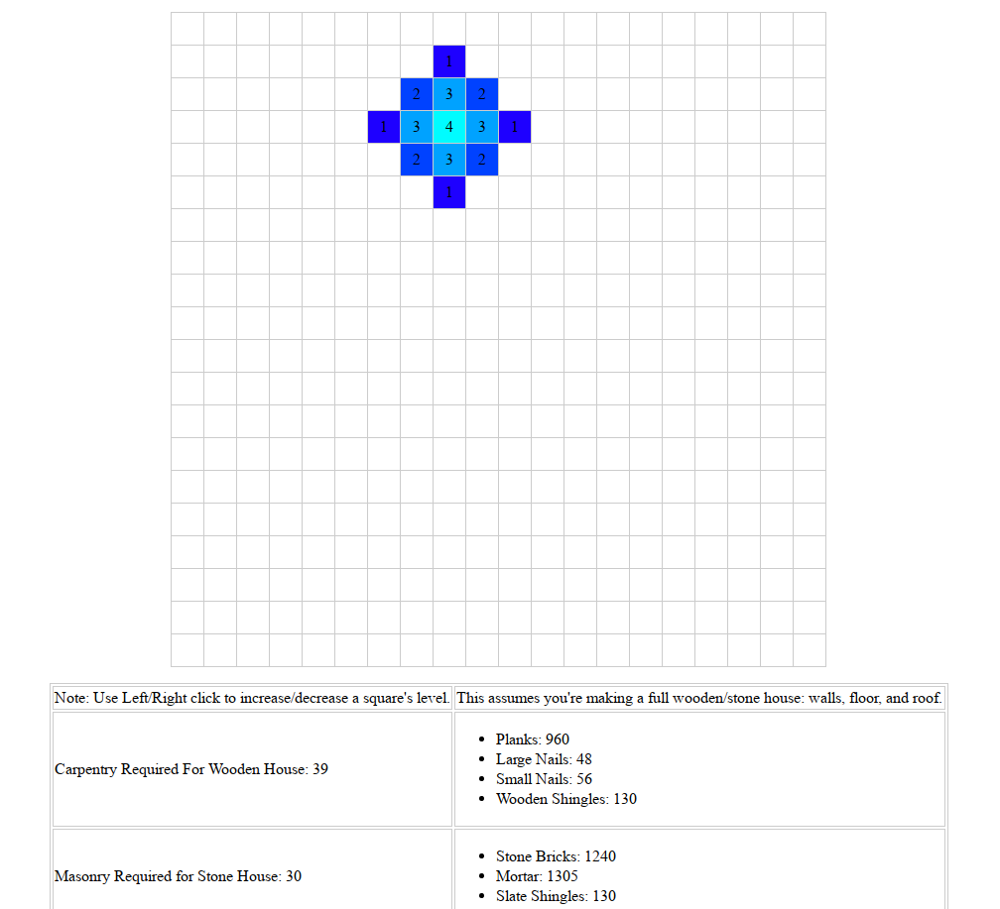

To see the application, go [here](https://divark.github.io/wurmhousingcalculator/).

# Wurm Housing Calculator
Ever wanted to know exactly how many materials you needed to build your new wooden/stone house, but you did not want to do the math in your head, or use a more sophisticated tool such as [Deedplanner](https://forum.wurmonline.com/index.php?/topic/79352-deedplanner-288-3d-house-and-deed-planner/)? Then this web application may be just for you!

The Wurm Housing Calculator is a third party web application built for simplicity to get you those numbers fast. Inspired by another user-made web application as shown [here](http://webdepp.sense-net.at/~toni/wurm/housecalc.php), this was made to look a bit nicer, and to do the calculations in real time.

## Features
- See what materials you need to make a wooden house
- See what materials you need to make a stone house
- All calculations are done per selection!
- Specify multi-level parts of your selection
